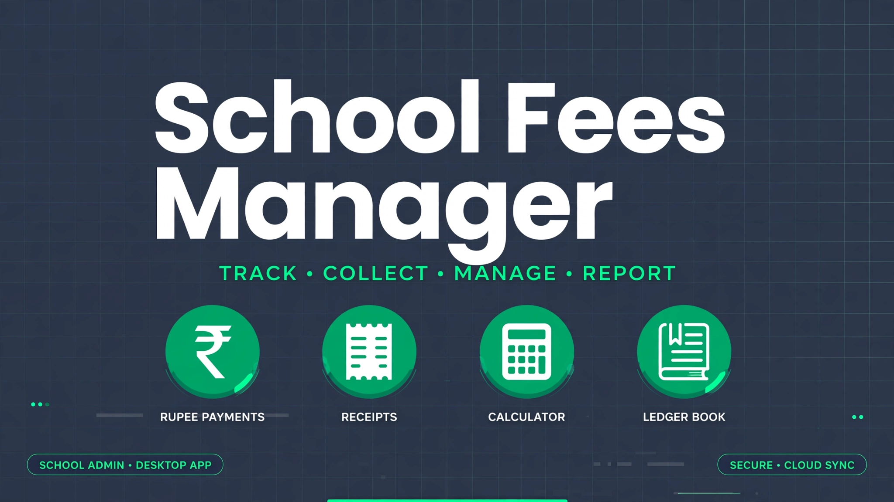

# School Fees Manager

> ## Status: 🟡 In Progress
>
> <progress value="80" max="100"></progress>
>
> **Progress: 80%** — Complete WPF app (students, fees, dashboard, receipts) with MVVM structure; Windows-only, not build-verified on Linux

<p align="center">
  
</p>


## What it is

A Windows desktop app for schools to manage student fees: track students, record fee payments, see a dashboard of collections/dues, and print receipts. Built with .NET 8 + WPF following the MVVM pattern (Views, ViewModels, Models, Services), with a local SQLite database (`SchoolFees.db3` in `%LocalAppData%\SchoolFeesManager`) — no server needed, runs fully offline.

## What works (verified)

- ✅ **MVVM structure** — `Views/` (Dashboard, Fees, AddStudent), `ViewModels/`, `Models/` (`Student`, `FeeModels`), `Services/DatabaseService`
- ✅ **UI converters** — `Converters/UIConverters.cs` for data-binding formatting
- ✅ **SQLite persistence** — local `SchoolFees.db3` via `sqlite-net-pcl`
- ✅ **Solution builds as a project** — `.sln` + `.csproj` present and well-formed
- ✅ **Planning docs** — `plan.md`, `progress.md`, `research.md`, `discovery.md` document the design

## Tech stack

| Layer | Tech |
|---|---|
| UI | WPF (.NET 8), XAML |
| Pattern | MVVM |
| Database | SQLite (`sqlite-net-pcl`), local file in AppData |
| IDE | Visual Studio 2022 (.NET Desktop workload) |

## How to run

**Windows 10/11** with .NET 8 SDK and Visual Studio 2022 (.NET Desktop Development workload).

```powershell
# Option 1: Visual Studio
# Open SchoolFeesManager/SchoolFeesManager.sln, set SchoolFeesManager as
# startup project, press F5.

# Option 2: CLI
dotnet restore SchoolFeesManager/SchoolFeesManager.sln
dotnet build SchoolFeesManager/SchoolFeesManager.sln -c Release
dotnet run --project SchoolFeesManager/SchoolFeesManager
```

WPF cannot build on Linux/macOS, so the build was verified by project-file inspection only — run it on Windows.

## Screenshots

No screenshots are committed in the repo. The banner above is generated; the app has Dashboard, Fees, and Add Student views.

## What you can add more

- [ ] **Screenshots** — capture the dashboard and fee-entry screens on Windows
- [ ] **Receipt printing** — generate printable/PDF receipts per payment
- [ ] **Fee reminders** — SMS/email for overdue fees
- [ ] **Reports** — monthly collection summaries, defaulter lists, export to Excel
- [ ] **Backup/restore** — one-click backup of the SQLite file
- [ ] **Multi-user roles** — admin vs accountant logins

## Project structure

```
├── SchoolFeesManager/
│   ├── SchoolFeesManager/        # WPF project
│   │   ├── Views/                # AddStudentView, DashboardView, FeesView
│   │   ├── ViewModels/           # AddStudentViewModel, DashboardViewModel…
│   │   ├── Models/               # Student, FeeModels
│   │   ├── Services/             # DatabaseService (SQLite)
│   │   └── Converters/           # UIConverters
│   └── SchoolFeesManager.sln
├── banner.webp
├── plan.md / progress.md / research.md / discovery.md
└── README.md (this file)
```

---
*README written after code audit on 2026-10-08.*
